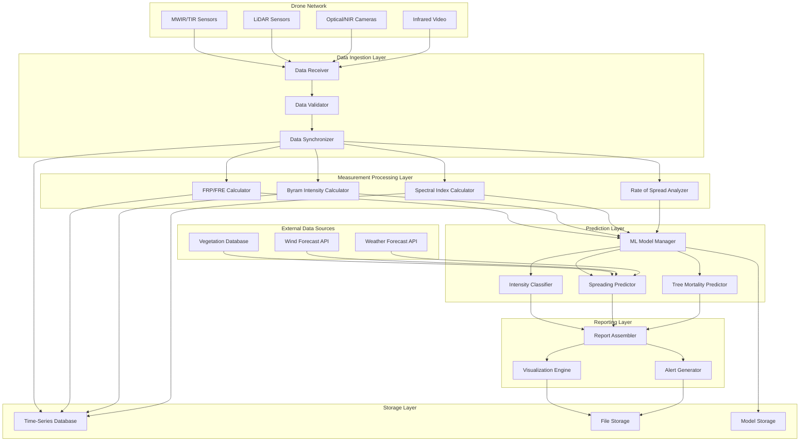

# Design Document: Fire Prediction AI System

## Overview

The Fire Prediction AI System is a distributed, real-time analysis platform that processes multi-sensor drone data to predict fire intensity and spreading patterns. The system architecture follows a pipeline design with four main stages:

1. **Data Ingestion Layer**: Receives and validates multi-sensor data from drone networks
2. **Measurement Processing Layer**: Calculates fire metrics (FRP, FRE, Byram's Intensity, spectral indices)
3. **Prediction Layer**: Applies machine learning models for intensity classification and spreading prediction
4. **Reporting Layer**: Generates comprehensive analysis reports with visualizations

The system is designed for low-latency processing (< 5 minutes end-to-end) to support real-time emergency response decisions.

## Architecture

### System Components



### Data Flow

1. **Ingestion**: Drone sensors stream data to the Data Receiver, which routes by sensor type
2. **Validation**: Data Validator checks format, completeness, and plausibility
3. **Synchronization**: Data Synchronizer aligns timestamps across sensor streams
4. **Processing**: Parallel processing of FRP/FRE, Byram's Intensity, spectral indices, and ROS
5. **Prediction**: ML Model Manager orchestrates intensity classification and spreading prediction
6. **Reporting**: Report Assembler combines all outputs into structured Analysis Report
7. **Storage**: All data persisted to time-series database and file storage

## Components and Interfaces

### 1. Data Ingestion Layer

#### Data Receiver
```
interface DataReceiver {
  receiveMWIRData(sensorId: string, timestamp: number, data: MWIRFrame): void
  receiveLiDARData(sensorId: string, timestamp: number, data: LiDARPointCloud): void
  receiveOpticalData(sensorId: string, timestamp: number, data: OpticalImage): void
  receiveInfraredVideo(sensorId: string, timestamp: number, data: VideoFrame): void
}

type MWIRFrame = {
  wavelength: number  // 3-5 μm
  pixels: number[][]  // temperature values in Kelvin
  resolution: { width: number, height: number }
  geolocation: GeoCoordinate[][]
}

type LiDARPointCloud = {
  points: Point3D[]
  intensity: number[]
  classification: string[]  // vegetation, ground, etc.
}

type OpticalImage = {
  bands: {
    red: number[][]
    green: number[][]
    blue: number[][]
    nir: number[][]  // near-infrared
    swir: number[][]  // short-wave infrared
  }
  geolocation: GeoCoordinate[][]
}
```

#### Data Validator
```
interface DataValidator {
  validateMWIR(data: MWIRFrame): ValidationResult
  validateLiDAR(data: LiDARPointCloud): ValidationResult
  validateOptical(data: OpticalImage): ValidationResult
  validateInfraredVideo(data: VideoFrame): ValidationResult
}

type ValidationResult = {
  isValid: boolean
  qualityScore: number  // 0.0 to 1.0
  errors: ValidationError[]
  warnings: ValidationWarning[]
}

type ValidationError = {
  field: string
  message: string
  severity: "critical" | "major" | "minor"
}
```

**Validation Rules**:
- MWIR wavelength must be 3-5 μm
- Temperature values must be 200-2000 K (physically plausible for fires)
- LiDAR points must have valid 3D coordinates
- Optical bands must have matching dimensions
- All data must include valid geolocation

#### Data Synchronizer
```
interface DataSynchronizer {
  synchronize(dataStreams: DataStream[]): SynchronizedDataset
  getTimeWindow(centerTime: number, windowSize: number): SynchronizedDataset
}

type SynchronizedDataset = {
  timestamp: number
  mwirData: MWIRFrame[]
  lidarData: LiDARPointCloud[]
  opticalData: OpticalImage[]
  videoData: VideoFrame[]
  qualityScore: number
}
```

**Synchronization Strategy**:
- Use GPS timestamps from drones as reference
- Align data within ±2 second window
- Interpolate missing data points when possible
- Flag datasets with poor temporal alignment

### 2. Measurement Processing Layer

#### FRP/FRE Calculator
```
interface FRPCalculator {
  calculateFRP(mwirData: MWIRFrame): FRPMeasurement
  calculateFRE(frpTimeSeries: FRPMeasurement[]): FREMeasurement
  detectHotSpots(mwirData: MWIRFrame, threshold: number): HotSpot[]
}

type FRPMeasurement = {
  timestamp: number
  totalPower: number  // MW
  spatialDistribution: number[][]  // MW per pixel
  peakPower: number
  peakLocation: GeoCoordinate
}

type FREMeasurement = {
  timeRange: { start: number, end: number }
  totalEnergy: number  // MJ
  averagePower: number  // MW
}

type HotSpot = {
  location: GeoCoordinate
  temperature: number  // Kelvin
  radiativePower: number  // MW
  area: number  // square meters
}
```

**FRP Calculation Method**:
- Apply Stefan-Boltzmann law: FRP = σ × ε × A × T⁴
- σ = Stefan-Boltzmann constant (5.67 × 10⁻⁸ W⋅m⁻²⋅K⁻⁴)
- ε = emissivity (0.9 for flames)
- A = pixel area in square meters
- T = temperature in Kelvin from MWIR data

#### Byram Intensity Calculator
```
interface ByramCalculator {
  calculateIntensity(
    heatOfCombustion: number,  // kJ/kg
    fuelConsumed: number,  // kg/m²
    rateOfSpread: number  // m/s
  ): ByramIntensity
  
  estimateFuelConsumed(
    preBurnLidar: LiDARPointCloud,
    postBurnLidar: LiDARPointCloud
  ): number
  
  applyFREDMethod(
    firePerimeter: Polygon,
    freMeasurements: FREMeasurement[]
  ): FREDMap
}

type ByramIntensity = {
  value: number  // kW/m
  classification: "low" | "moderate" | "high" | "extreme"
  suppressionDifficulty: "easy" | "moderate" | "difficult" | "impossible"
}

type FREDMap = {
  perimeter: Polygon
  densityGrid: number[][]  // MJ/m² per grid cell
  resolution: number  // meters per cell
}
```

**Byram Classification Thresholds**:
- Low: < 500 kW/m
- Moderate: 500-2000 kW/m
- High: 2000-4000 kW/m
- Extreme: > 4000 kW/m

#### Rate of Spread Analyzer
```
interface ROSAnalyzer {
  calculateROS(videoFrames: VideoFrame[]): ROSMeasurement
  trackFireFront(frames: VideoFrame[]): FireFrontTrajectory
}

type ROSMeasurement = {
  averageRate: number  // m/s
  direction: number  // degrees (0-360)
  variability: number  // standard deviation
  confidence: number  // 0.0 to 1.0
}

type FireFrontTrajectory = {
  timestamps: number[]
  positions: GeoCoordinate[][]  // perimeter points at each timestamp
  velocities: number[][]  // m/s at each perimeter point
}
```

**ROS Calculation Method**:
- Extract fire perimeter from each video frame using edge detection
- Track perimeter movement between consecutive frames
- Calculate displacement in meters using geolocation data
- Divide by time interval to get rate of spread
- Apply pixel-based motion analysis for sub-pixel accuracy

#### Spectral Index Calculator
```
interface SpectralIndexCalculator {
  calculateNBR(opticalData: OpticalImage): NBRResult
  calculatedNBR(preFire: NBRResult, postFire: NBRResult): dNBRResult
  calculateRdNBR(dnbr: dNBRResult, preFire: NBRResult): RdNBRResult
  classifySeverity(rdnbr: RdNBRResult): SeverityMap
}

type NBRResult = {
  values: number[][]  // -1 to 1
  geolocation: GeoCoordinate[][]
  timestamp: number
}

type dNBRResult = {
  values: number[][]
  geolocation: GeoCoordinate[][]
  timeRange: { preFire: number, postFire: number }
}

type RdNBRResult = {
  values: number[][]
  geolocation: GeoCoordinate[][]
}

type SeverityMap = {
  classification: ("unburned" | "low" | "moderate" | "high")[][]
  geolocation: GeoCoordinate[][]
  statistics: {
    unburned: number  // percentage
    low: number
    moderate: number
    high: number
  }
}
```

**Spectral Index Formulas**:
- NBR = (NIR - SWIR) / (NIR + SWIR)
- dNBR = NBR_prefire - NBR_postfire
- RdNBR = dNBR / sqrt(|NBR_prefire|)

**Severity Classification Thresholds**:
- Unburned: dNBR < 0.1
- Low: 0.1 ≤ dNBR < 0.27
- Moderate: 0.27 ≤ dNBR < 0.66
- High: dNBR ≥ 0.66

### 3. Prediction Layer

#### ML Model Manager
```
interface MLModelManager {
  loadModel(modelType: ModelType): Model
  predict(modelType: ModelType, features: FeatureVector): Prediction
  retrain(modelType: ModelType, trainingData: TrainingDataset): ModelMetrics
  validateModel(modelType: ModelType, validationData: ValidationDataset): ModelMetrics
}

type ModelType = "intensity_classifier" | "spreading_predictor" | "tree_mortality"

type FeatureVector = {
  frp: number
  fre: number
  byramIntensity: number
  ros: number
  nbr: number
  dnbr: number
  rdnbr: number
  fuelLoad: number
  windSpeed: number
  windDirection: number
  temperature: number
  humidity: number
  slope: number
  aspect: number
  vegetationType: string
}

type ModelMetrics = {
  accuracy: number
  precision: number
  recall: number
  f1Score: number
  confusionMatrix: number[][]
}
```

#### Intensity Classifier
```
interface IntensityClassifier {
  classify(features: FeatureVector): IntensityPrediction
  classifyBatch(features: FeatureVector[]): IntensityPrediction[]
}

type IntensityPrediction = {
  category: "low" | "moderate" | "high" | "extreme"
  confidence: number  // 0.0 to 1.0
  probabilities: {
    low: number
    moderate: number
    high: number
    extreme: number
  }
}
```

**Model Architecture**:
- YOLO-like convolutional neural network for spatial feature extraction
- Multi-scale feature pyramid for detecting fires at different scales
- Classification head with 4 output classes
- Input: Multi-channel tensor (MWIR, optical, LiDAR-derived features)

#### Spreading Predictor
```
interface SpreadingPredictor {
  predictSpreading(
    currentState: FireState,
    vegetation: VegetationData,
    wind: WindForecast,
    weather: WeatherForecast
  ): SpreadingPrediction
}

type FireState = {
  perimeter: Polygon
  intensity: ByramIntensity
  ros: ROSMeasurement
  timestamp: number
}

type VegetationData = {
  fuelType: string[][]  // grid of fuel types
  fuelLoad: number[][]  // kg/m²
  fuelMoisture: number[][]  // percentage
  month: number  // 1-12 for seasonal variation
}

type WindForecast = {
  forecasts: {
    timestamp: number
    speed: number  // m/s
    direction: number  // degrees
    gusts: number  // m/s
  }[]
}

type WeatherForecast = {
  forecasts: {
    timestamp: number
    temperature: number  // Celsius
    humidity: number  // percentage
    precipitation: number  // mm
  }[]
  forecastHorizon: number  // hours (48 for 2 days)
}

type SpreadingPrediction = {
  predictions: {
    timestamp: number
    predictedPerimeter: Polygon
    spreadingRate: number  // m/hour
    spreadingDirection: number  // degrees
    confidence: number
  }[]
  uncertaintyBounds: Polygon[]  // confidence intervals
}
```

**Spreading Model**:
- Physics-based fire spread model (Rothermel or similar)
- Inputs: fuel characteristics, weather, topography, current fire state
- Accounts for wind-driven spread, slope effects, fuel moisture
- Monte Carlo simulation for uncertainty quantification

#### Tree Mortality Predictor
```
interface TreeMortalityPredictor {
  predictMortality(
    trees: TreeData[],
    burnSeverity: SeverityMap,
    fireIntensity: ByramIntensity
  ): MortalityPrediction
}

type TreeData = {
  location: GeoCoordinate
  species: string
  height: number  // meters
  diameter: number  // cm
  crownBaseHeight: number  // meters
}

type MortalityPrediction = {
  trees: {
    treeId: string
    location: GeoCoordinate
    mortalityProbability: number  // 0.0 to 1.0
    predictedOutcome: "survive" | "mortality"
    confidence: number
  }[]
  spatialMap: number[][]  // mortality probability grid
  overallMortality: number  // percentage
}
```

**Model Architecture**:
- Random Forest classifier with 100+ trees
- Features: burn severity, fire intensity, tree characteristics, bark thickness
- Target accuracy: ≥ 75%

### 4. Reporting Layer

#### Report Assembler
```
interface ReportAssembler {
  generateReport(
    measurements: Measurements,
    predictions: Predictions,
    metadata: ReportMetadata
  ): AnalysisReport
}

type Measurements = {
  frp: FRPMeasurement
  fre: FREMeasurement
  byramIntensity: ByramIntensity
  ros: ROSMeasurement
  spectralIndices: {
    nbr: NBRResult
    dnbr: dNBRResult
    rdnbr: RdNBRResult
  }
  severity: SeverityMap
}

type Predictions = {
  intensity: IntensityPrediction
  spreading: SpreadingPrediction
  treeMortality: MortalityPrediction
}

type ReportMetadata = {
  incidentId: string
  timestamp: number
  location: GeoCoordinate
  droneIds: string[]
  processingTime: number  // milliseconds
}

type AnalysisReport = {
  metadata: ReportMetadata
  summary: {
    currentIntensity: string
    spreadingRate: number
    spreadingDirection: number
    threatLevel: "low" | "moderate" | "high" | "extreme"
  }
  measurements: Measurements
  predictions: Predictions
  visualizations: {
    intensityMap: string  // file path or URL
    spreadingMap: string
    severityMap: string
    mortalityMap: string
  }
  confidenceScores: {
    overall: number
    measurements: number
    predictions: number
  }
  recommendations: string[]
  alerts: Alert[]
}

type Alert = {
  severity: "info" | "warning" | "critical"
  message: string
  timestamp: number
  affectedArea: Polygon
}
```

#### Visualization Engine
```
interface VisualizationEngine {
  generateIntensityMap(frp: FRPMeasurement, perimeter: Polygon): ImageFile
  generateSpreadingMap(prediction: SpreadingPrediction, terrain: TerrainData): ImageFile
  generateSeverityMap(severity: SeverityMap): ImageFile
  generateMortalityMap(mortality: MortalityPrediction): ImageFile
  overlayOnBasemap(layers: Layer[], basemap: Basemap): ImageFile
}

type ImageFile = {
  format: "PNG" | "GeoTIFF"
  data: Buffer
  metadata: {
    bounds: BoundingBox
    resolution: number
    colormap: string
  }
}
```

#### Alert Generator
```
interface AlertGenerator {
  generateAlerts(
    report: AnalysisReport,
    thresholds: AlertThresholds
  ): Alert[]
  
  checkCriticalConditions(
    intensity: ByramIntensity,
    spreading: SpreadingPrediction
  ): Alert[]
}

type AlertThresholds = {
  highIntensity: number  // kW/m
  rapidSpread: number  // m/hour
  proximityToStructures: number  // meters
  extremeWeather: boolean
}
```

### 5. Storage Layer

#### Time-Series Database
```
interface TimeSeriesDB {
  storeMeasurement(
    incidentId: string,
    timestamp: number,
    measurementType: string,
    value: any
  ): void
  
  query(
    incidentId: string,
    timeRange: { start: number, end: number },
    measurementTypes: string[]
  ): TimeSeriesData[]
}

type TimeSeriesData = {
  incidentId: string
  timestamp: number
  measurementType: string
  value: any
  metadata: Record<string, any>
}
```

#### File Storage
```
interface FileStorage {
  storeReport(incidentId: string, report: AnalysisReport): string
  storeVisualization(incidentId: string, image: ImageFile): string
  retrieveReport(incidentId: string, timestamp: number): AnalysisReport
  listReports(incidentId: string): ReportMetadata[]
}
```

#### Model Storage
```
interface ModelStorage {
  saveModel(modelType: ModelType, model: Model, version: string): void
  loadModel(modelType: ModelType, version: string): Model
  listVersions(modelType: ModelType): ModelVersion[]
}

type ModelVersion = {
  version: string
  timestamp: number
  metrics: ModelMetrics
  trainingDataSize: number
}
```

## Data Models

### Core Types

```typescript
type GeoCoordinate = {
  latitude: number
  longitude: number
  altitude: number  // meters above sea level
}

type Polygon = {
  exterior: GeoCoordinate[]
  holes: GeoCoordinate[][]
}

type BoundingBox = {
  minLat: number
  maxLat: number
  minLon: number
  maxLon: number
}

type Point3D = {
  x: number
  y: number
  z: number
}

type VideoFrame = {
  timestamp: number
  pixels: number[][]
  format: "thermal" | "visible"
  geolocation: GeoCoordinate[][]
}

type TerrainData = {
  elevation: number[][]
  slope: number[][]
  aspect: number[][]
  resolution: number  // meters per cell
}

type Basemap = {
  type: "satellite" | "topographic" | "street"
  bounds: BoundingBox
  zoom: number
}

type Layer = {
  type: "intensity" | "spreading" | "severity" | "mortality"
  data: number[][]
  opacity: number
  colormap: string
}
```

### Database Schema

**Incidents Table**:
```sql
CREATE TABLE incidents (
  incident_id VARCHAR(50) PRIMARY KEY,
  start_time TIMESTAMP NOT NULL,
  end_time TIMESTAMP,
  location GEOGRAPHY(POINT),
  status VARCHAR(20),
  metadata JSONB
);
```

**Measurements Table**:
```sql
CREATE TABLE measurements (
  measurement_id SERIAL PRIMARY KEY,
  incident_id VARCHAR(50) REFERENCES incidents(incident_id),
  timestamp TIMESTAMP NOT NULL,
  measurement_type VARCHAR(50) NOT NULL,
  value JSONB NOT NULL,
  quality_score FLOAT,
  INDEX (incident_id, timestamp, measurement_type)
);
```

**Reports Table**:
```sql
CREATE TABLE reports (
  report_id SERIAL PRIMARY KEY,
  incident_id VARCHAR(50) REFERENCES incidents(incident_id),
  timestamp TIMESTAMP NOT NULL,
  report_data JSONB NOT NULL,
  file_path VARCHAR(255),
  processing_time_ms INTEGER,
  INDEX (incident_id, timestamp)
);
```

**Models Table**:
```sql
CREATE TABLE models (
  model_id SERIAL PRIMARY KEY,
  model_type VARCHAR(50) NOT NULL,
  version VARCHAR(20) NOT NULL,
  created_at TIMESTAMP NOT NULL,
  metrics JSONB,
  file_path VARCHAR(255),
  UNIQUE (model_type, version)
);
```


## Correctness Properties

*A property is a characteristic or behavior that should hold true across all valid executions of a system—essentially, a formal statement about what the system should do. Properties serve as the bridge between human-readable specifications and machine-verifiable correctness guarantees.*

### Property 1: FRP Calculation Validity

*For any* valid MWIR frame with temperature data in the range 200-2000 K, calculating Fire Radiative Power should produce a positive value in megawatts that follows the Stefan-Boltzmann law (FRP = σ × ε × A × T⁴).

**Validates: Requirements 1.1**

### Property 2: FRE Integration Correctness

*For any* time series of FRP measurements, the cumulative Fire Radiative Energy should equal the integral of FRP over time, and should be monotonically increasing.

**Validates: Requirements 1.2**

### Property 3: Hot Spot Detection Completeness

*For any* thermal image with temperature peaks above the detection threshold, all hot spots should be identified and their locations should fall within the fire perimeter polygon.

**Validates: Requirements 1.3**

### Property 4: ROS Calculation from Video

*For any* sequence of infrared video frames with identifiable fire front movement, the calculated Rate of Spread should match the displacement distance divided by time interval, within measurement uncertainty.

**Validates: Requirements 2.1**

### Property 5: Fuel Consumption from LiDAR Difference

*For any* pair of pre-burn and post-burn LiDAR point clouds, the calculated fuel consumed per unit area should equal the difference in vegetation biomass between the two scans.

**Validates: Requirements 2.2**

### Property 6: Byram Intensity Formula

*For any* valid values of heat of combustion (H), fuel consumed (w), and rate of spread (ROS), the calculated Byram intensity should exactly equal H × w × ROS in kW/m.

**Validates: Requirements 2.3**

### Property 7: FRED Mapping Consistency

*For any* fire perimeter and set of FRE measurements, the FRED map should have total energy equal to the sum of all FRE measurements, and density values should be non-negative.

**Validates: Requirements 2.4**

### Property 8: High Intensity Flagging

*For any* Byram intensity value, fires with intensity > 4000 kW/m should be flagged as high-intensity, and fires with intensity ≤ 4000 kW/m should not be flagged.

**Validates: Requirements 2.5**

### Property 9: NBR Range Constraint

*For any* optical image with NIR and SWIR bands, the calculated Normalized Burn Ratio should fall within the range [-1, 1], following the formula NBR = (NIR - SWIR) / (NIR + SWIR).

**Validates: Requirements 3.1**

### Property 10: dNBR Calculation

*For any* pair of pre-fire and post-fire NBR values, the differenced NBR should equal NBR_prefire - NBR_postfire.

**Validates: Requirements 3.2**

### Property 11: RdNBR Normalization

*For any* dNBR value and pre-fire NBR value, the relative dNBR should equal dNBR / sqrt(|NBR_prefire|), handling the case where NBR_prefire is zero.

**Validates: Requirements 3.3**

### Property 12: Severity Classification Thresholds

*For any* dNBR value, the burn severity classification should be: unburned if dNBR < 0.1, low if 0.1 ≤ dNBR < 0.27, moderate if 0.27 ≤ dNBR < 0.66, and high if dNBR ≥ 0.66.

**Validates: Requirements 3.4**

### Property 13: Multi-Sensor Feature Integration

*For any* collection of multi-sensor data (LiDAR, IR, visible imagery), the unified feature vector should contain features from all available sensor types, with no sensor data omitted.

**Validates: Requirements 4.1**

### Property 14: Intensity Classification Output Validity

*For any* feature vector input to the intensity classifier, the output should be one of the valid categories (low, moderate, high, extreme) with confidence scores summing to 1.0.

**Validates: Requirements 4.2**

### Property 15: Vegetation Month Sensitivity

*For any* fire state and terrain, changing the vegetation month parameter should affect the spreading prediction, reflecting seasonal fuel characteristic variations.

**Validates: Requirements 5.1**

### Property 16: Wind Direction Influence

*For any* fire state with wind forecast, the predicted spreading direction should be influenced by wind direction, with stronger winds causing greater directional bias.

**Validates: Requirements 5.2**

### Property 17: Weather Forecast Horizon

*For any* weather forecast with 48-hour horizon, the spreading predictions should extend to cover the full forecast period.

**Validates: Requirements 5.3**

### Property 18: Spreading Prediction Output Format

*For any* fire state and environmental conditions, the spreading prediction should include rate in m/hour (positive value) and direction in degrees (0-360) with confidence intervals.

**Validates: Requirements 5.4, 5.5**

### Property 19: Topographic Slope Effect

*For any* fire state on sloped terrain, the predicted spreading rate upslope should be greater than the rate downslope, all else being equal.

**Validates: Requirements 5.6**

### Property 20: Multi-Sensor Data Processing

*For any* combination of MWIR/TIR, infrared video, LiDAR, and optical/NIR data, the system should process all available sensor types and produce corresponding measurements (FRP/FRE, Byram intensity, spectral indices).

**Validates: Requirements 6.1, 6.2, 6.3**

### Property 21: Timestamp Synchronization

*For any* set of sensor data streams with timestamps within a 2-second window, the synchronized dataset should align all data to a common reference time.

**Validates: Requirements 6.4**

### Property 22: Quality-Based Flagging

*For any* sensor data with quality score below the reliability threshold, the system should flag the data as unreliable and exclude it from critical calculations.

**Validates: Requirements 6.5**

### Property 23: Analysis Report Completeness

*For any* complete set of measurements and predictions, the generated Analysis Report should contain all required fields: fire intensity, spreading rate with uncertainty bounds, spreading direction with maps, all input measurements (FRP, FRE, Byram intensity, spectral indices), confidence scores for all predictions, and spatial maps when tree mortality data is available.

**Validates: Requirements 7.1, 7.2, 7.3, 7.4, 7.5, 7.6**

### Property 24: Data Format Validation

*For any* incoming sensor data, the system should validate format and completeness, rejecting data that fails validation checks before processing.

**Validates: Requirements 9.1**

### Property 25: Range Anomaly Detection

*For any* calculated value, if it falls outside physically plausible ranges (e.g., temperature < 200 K or > 2000 K, negative power), the system should flag it as an anomaly.

**Validates: Requirements 9.2**

### Property 26: Cross-Sensor Validation

*For any* set of measurements from multiple sensors observing the same fire, the system should detect inconsistencies when measurements disagree beyond expected uncertainty bounds.

**Validates: Requirements 9.3**

### Property 27: Validation Error Logging

*For any* validation failure, the error log should contain the sensor identifier, timestamp, and description of the validation failure.

**Validates: Requirements 9.4**

### Property 28: Report Quality Score

*For any* Analysis Report, the quality score should reflect the quality of input data, with higher input quality scores resulting in higher report quality scores.

**Validates: Requirements 9.5**

### Property 29: Data Storage Round-Trip

*For any* sensor input, measurement, or prediction with metadata, storing it to the database and then retrieving it by incident ID, timestamp, or location should return data equivalent to the original.

**Validates: Requirements 10.1, 10.2**

## Error Handling

### Error Categories

1. **Data Validation Errors**
   - Invalid sensor data format
   - Missing required fields
   - Out-of-range values
   - Timestamp synchronization failures

2. **Processing Errors**
   - Calculation failures (division by zero, numerical instability)
   - Model inference errors
   - Insufficient data for analysis

3. **System Errors**
   - Database connection failures
   - File storage errors
   - External API timeouts (weather, wind forecasts)
   - Model loading failures

### Error Handling Strategies

**Data Validation Errors**:
```
WHEN invalid sensor data is detected:
  1. Log error with sensor ID, timestamp, and validation failure details
  2. Flag data as unreliable in quality score
  3. Continue processing with remaining valid sensors
  4. If critical sensors fail, request data re-collection
  5. Include data quality warnings in Analysis Report
```

**Processing Errors**:
```
WHEN calculation fails:
  1. Log error with calculation type and input values
  2. Attempt fallback calculation method if available
  3. If fallback fails, mark measurement as unavailable
  4. Continue with remaining measurements
  5. Reduce overall confidence score in report
  6. Alert operator if critical measurement fails
```

**System Errors**:
```
WHEN system component fails:
  1. Log error with component name and error details
  2. Attempt retry with exponential backoff (max 3 attempts)
  3. If persistent, fail gracefully and notify operator
  4. For database errors: queue data for later storage
  5. For API errors: use cached/default values if available
  6. Include system error warnings in report
```

### Error Recovery

**Graceful Degradation**:
- System continues operating with reduced functionality when non-critical components fail
- Missing sensor data: use available sensors and reduce confidence scores
- Missing external data (weather/wind): use historical averages with warnings
- Model failures: fall back to physics-based calculations

**Data Quality Thresholds**:
- Minimum 2 sensor types required for analysis
- Quality score < 0.3: issue warning, continue processing
- Quality score < 0.1: abort analysis, request better data
- Missing critical measurements (FRP or Byram): cannot generate report

**Retry Logic**:
- External API calls: 3 retries with exponential backoff (1s, 2s, 4s)
- Database operations: 5 retries with 500ms intervals
- Model inference: 2 retries, then fall back to simpler model

## Testing Strategy

### Dual Testing Approach

The system requires both unit testing and property-based testing for comprehensive coverage:

**Unit Tests**: Verify specific examples, edge cases, and error conditions
- Specific sensor data examples with known outputs
- Edge cases: empty data, single-pixel fires, extreme values
- Error conditions: malformed data, missing fields, timeouts
- Integration points between components

**Property Tests**: Verify universal properties across all inputs
- Run minimum 100 iterations per property test
- Use property-based testing library (e.g., Hypothesis for Python, fast-check for TypeScript)
- Each test references its design document property
- Tag format: **Feature: fire-prediction-ai, Property {number}: {property_text}**

### Property-Based Testing Configuration

**Test Library Selection**:
- Python: Hypothesis
- TypeScript/JavaScript: fast-check
- Java: jqwik
- Other languages: appropriate PBT library

**Test Configuration**:
```python
# Example for Python/Hypothesis
@given(mwir_frame=valid_mwir_frames())
@settings(max_examples=100)
def test_frp_calculation_validity():
    """
    Feature: fire-prediction-ai, Property 1: FRP Calculation Validity
    For any valid MWIR frame, FRP should be positive and follow Stefan-Boltzmann law
    """
    frp = calculate_frp(mwir_frame)
    assert frp.total_power > 0
    assert frp.total_power < theoretical_maximum(mwir_frame)
    # Verify Stefan-Boltzmann relationship
    expected_frp = stefan_boltzmann_calculation(mwir_frame)
    assert abs(frp.total_power - expected_frp) / expected_frp < 0.01
```

### Test Coverage Requirements

**Component-Level Testing**:
- Data Ingestion Layer: 90% code coverage
  - Test all sensor data types
  - Test validation rules
  - Test synchronization logic

- Measurement Processing Layer: 95% code coverage
  - Test all calculation formulas
  - Test edge cases (zero values, extremes)
  - Test numerical stability

- Prediction Layer: 85% code coverage
  - Test model inference paths
  - Test feature engineering
  - Test prediction output formats

- Reporting Layer: 90% code coverage
  - Test report generation
  - Test visualization creation
  - Test alert logic

**Integration Testing**:
- End-to-end pipeline tests with realistic sensor data
- Multi-sensor integration scenarios
- Error propagation and recovery
- Performance under load (multiple concurrent incidents)

**Property-Based Testing Coverage**:
- Each correctness property must have at least one property-based test
- Properties 1-29 from design document must all be implemented
- Each test runs minimum 100 iterations with randomized inputs

### Test Data Generation

**Synthetic Data Generators**:
```python
# Example generators for property-based testing
@composite
def valid_mwir_frames(draw):
    """Generate valid MWIR frames for testing"""
    width = draw(integers(min_value=100, max_value=1000))
    height = draw(integers(min_value=100, max_value=1000))
    temperatures = draw(arrays(
        dtype=float,
        shape=(height, width),
        elements=floats(min_value=200, max_value=2000)
    ))
    return MWIRFrame(
        wavelength=draw(floats(min_value=3.0, max_value=5.0)),
        pixels=temperatures,
        resolution={'width': width, 'height': height},
        geolocation=generate_geolocation_grid(width, height)
    )

@composite
def fire_states(draw):
    """Generate random fire states for spreading prediction tests"""
    perimeter = draw(valid_polygons())
    intensity = draw(byram_intensities())
    ros = draw(ros_measurements())
    return FireState(
        perimeter=perimeter,
        intensity=intensity,
        ros=ros,
        timestamp=draw(timestamps())
    )
```

**Edge Case Coverage**:
- Empty/minimal data: single pixel, single point cloud point
- Extreme values: very high temperatures, very fast ROS
- Boundary conditions: NBR at -1 and 1, intensity at thresholds
- Missing data: partial sensor coverage, gaps in time series
- Invalid data: negative values, NaN, infinity

### Performance Testing

**Latency Requirements**:
- Data ingestion: < 1 second per sensor stream
- Measurement processing: < 30 seconds for full analysis
- Prediction generation: < 2 minutes including ML inference
- Report generation: < 30 seconds
- End-to-end: < 5 minutes from data arrival to report delivery

**Throughput Requirements**:
- Support 10+ concurrent fire incidents
- Process 100+ sensor data streams simultaneously
- Handle 1000+ measurements per second

**Load Testing**:
- Simulate multiple concurrent incidents
- Stress test with high-frequency sensor data
- Test database performance under load
- Test model inference throughput

### Continuous Integration

**Automated Testing Pipeline**:
1. Unit tests run on every commit
2. Property-based tests run on every pull request
3. Integration tests run nightly
4. Performance tests run weekly
5. Full system tests run before releases

**Test Reporting**:
- Code coverage reports
- Property test failure analysis
- Performance benchmarks
- Regression detection

**Quality Gates**:
- All unit tests must pass
- Code coverage > 85%
- All property tests must pass (100 iterations each)
- No critical security vulnerabilities
- Performance within latency requirements
